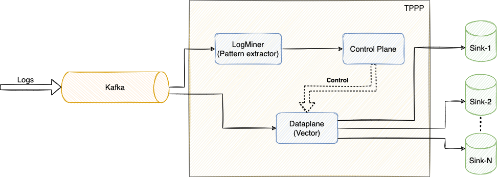
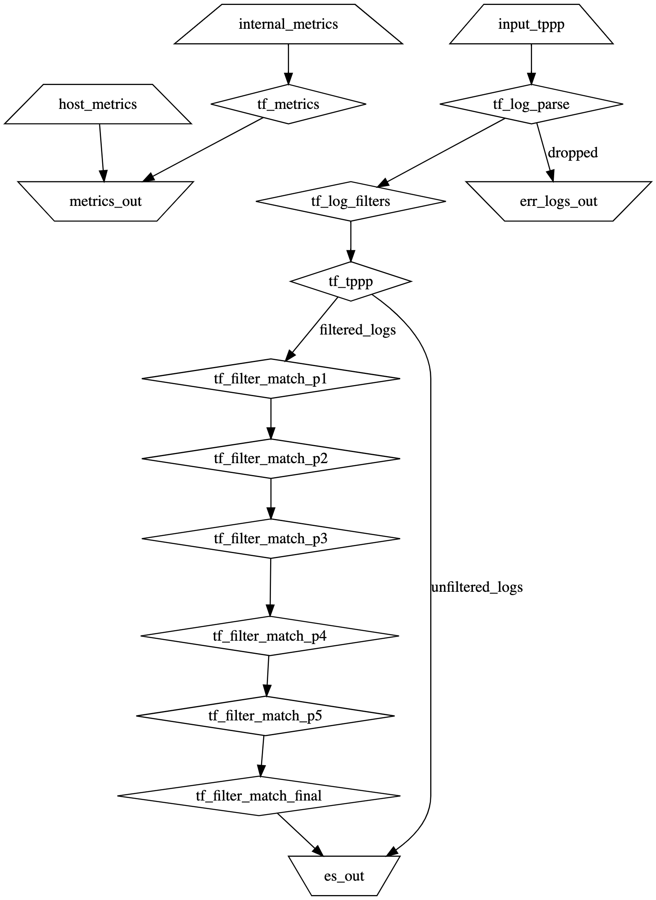

# TPPP (Telemetry Pre-processing Pipeline)



TPPP can be used to detect frequent patterns from a streaming log (LogMiner),
and to filter out some of these patterns before sending it out to the
targeted data sink.

Let's assume some existing pipeline stream logs into a `kafka` topic that is
consumer by our `Dataplane` service - where it will go through the filtering
components for dropping the patterns that has already been extracted using
the `LogMiner` service, and after filtering stream the logs into the appropriate
data sinks.

## Currently available services
# Dataplane
The dataplane deployment is done by using [Helm](https://helm.sh/docs/intro/quickstart/)
(package manager for k8s), which can be found under the directory `deploy/helm`.
We are using [Vector](https://vector.dev) to build our data pipeline.

### Requirements
The following tools/packages are required for running or deploying the
`tppp-dataplane`
- **awscli**
- **kubectl**
- **helm**
- **vector** (for validating pipeline-config and generating pipeline-graph)

#### Production deployment
For deploying the vector data pipeline into our prod EKS, the first step is to
configure your `kubectl` with the correct `kubeconfig` for it to be able to
connect with the `tppp` EKS cluster -
[link here](https://aws.amazon.com/premiumsupport/knowledge-center/eks-cluster-connection/)
```commandline
aws eks update-kubeconfig --region <YOUR-REGION> --name <CLUSTER-NAME> --profile <PROFILE-NAME>
```
This should end with a message saying the context was created successfully.
Check that you can see the services/nodes for the added cluster by running
```commandline
kubectl get svc
kubectl get nodes
```

Couple of extra steps for deploying `tppp-dataplane` in EKS for the first time -
1. Deploy Kubernetes Metrics Server for HPA - [link](https://docs.aws.amazon.com/eks/latest/userguide/metrics-server.html)
    1. This is required for fetching the host metrics (cpu/memory) from each of
       the nodes within the EKS cluster for the HPA.
    2. Start the metrics-server by running -
```commandline
kubectl apply -f https://github.com/kubernetes-sigs/metrics-server/releases/latest/download/components.yaml
```
2. Configure and deploy Cluster-Autoscaler for EKS - [link](https://docs.aws.amazon.com/eks/latest/userguide/autoscaling.html)
    1. This service is required for the EKS to be able to create/delete nodes
       within the nodegroup as required (depending on the HPA).
    2. After adding the IAM policies to the required roles (please check
       the link), modify the cluster name from line `163` of
       `deploy/helm/vector/k8s_manifest/cluster-autoscaler-autodiscover.yaml`,
       from `<YOUR-CLUSTER-NAME>` to your cluster name.
    3. Start the cluster-autoscaler by running -
```commandline
cd deploy/helm/vector/k8s_manifest/
kubectl apply -f cluster-autoscaler-autodiscover.yaml
```

#### Local deployment
You can also deploy the helm-chart locally - the recommended route is to have
a minikube setup. Please make sure the local-minikube is set as the kubectl
context - more on this [here](https://stackoverflow.com/questions/43643463/how-to-switch-kubectl-clusters-between-gcloud-and-minikube).
Starting a minikube setup using `minikube start` changes the kubectl context
automatically.

### Deploying using `deploy.py` script

Before starting a cluster, you'll need at least two files -
1. **deploy.yaml** - the vector-version to deploy and one or more deploy
   modes with the corresponding `values.yaml` file and the `context` of the cluster.
2. **values_{deploy-mode}.yaml** - the `values.yaml` file to use for the deployment
   of the vector helm-chart.
Make sure you update the placeholder files for these within the repo, before
any deployments.

(**Optional**) If you have these files stored in an S3 bucket, you can use the
`download_cfg` operation to download the files before running the cluster
operation commands.
```commandline
python3 deploy.py --operation download_cfg --s3_location <bucket-name> <object-name>
```

#### Starting a cluster
```commandline
python3 deploy.py --deploy_mode {your-mode} --operation start
```

#### Stopping a cluster
```commandline
python3 deploy.py --deploy_mode {your-mode} --operation stop
```

#### Upgrading an existing cluster
```commandline
python3 deploy.py --deploy_mode {your-mode} --operation upgrade
```

#### Generate the vector-pipeline graph
```commandline
python3 deploy.py --deploy_mode {your-mode} --operation graph
```
After the graph is generated in `dot` notation within the `graph.out`, you can
use any graphviz online generator tool like
[this](https://dreampuf.github.io/GraphvizOnline/) generate the pipeline graph.

### (Optional) Deploying using helm
For manually deploying the vector helm-chart, you can need to follow these
steps -
1. Add the vector repo in helm
```commandline
helm repo add vector https://helm.vector.dev
helm repo update
```
2. Create your own `values.yaml` file under `deploy/helm/vector/`
3. Check if the correct `kubectl` context is set, can be checked by running
`kubectl config current-context`
4. (First-time deployment) Run the install command -
```commandline
cd deploy/helm/vector/
helm install <name-of-your-deployment> vector/vector --version 0.9.0 --values values.yaml
```
5. (Optional) For updating a current deployment -
```commandline
helm upgrade <name-of-your-deployment> vector/vector --version 0.9.0 --values values.yaml
```
6. (Optional) For deleting a running deployment -
```commandline
helm delete <name-of-your-deployment>
```

### Setting up Dataplane dashboard in Grafana
A sample Grafana dashboard's JSON model is provided within the `dashboard`
folder. The provided panels are there as a guideline only. If you are planning
on importing the dashboard through the provided JSON, please
configure the data-source correctly for the panels. To get the metrics out of
vector for monitoring, we have added an AWS Cloudwatch sink - and those metrics
are being queried from the dashboard panels here.

### Vector configuration
For configuring the vector pipeline that's being deployed through helm-chart,
I'm currently modifying `customConfig` property found in the `values.yaml`
file for the vector helm-chart (`deploy/helm/vector/values.yaml`). There is a
plan to separate the vector-config out of this helm-chart in the near future.

Vector has three major types components -
- Sources
- Transforms
- Sinks

The `transform` components are the ones where the majority of the processing
lies, and as the name suggests, `sources` and `sinks` are for controlling what
data is ingested by the vector pipeline, and, what/where the output from the
pipeline is going.

The current components for each of the types that are being used by our
pipeline is described below:
- Sources
    - [fluent](https://vector.dev/docs/reference/configuration/sources/fluent/)
    - [internal_metrics](https://vector.dev/docs/reference/configuration/sources/internal_metrics/)
    - [host_metrics](https://vector.dev/docs/reference/configuration/sources/host_metrics/)
- Transforms
    - [route](https://vector.dev/docs/reference/configuration/transforms/route/)
    - [filter](https://vector.dev/docs/reference/configuration/transforms/filter/)
    - [sample](https://vector.dev/docs/reference/configuration/transforms/sample/)
- Sinks
    - [elasticsearch](https://vector.dev/docs/reference/configuration/sinks/elasticsearch/)
    - [aws_cloudwatch_metrics](https://vector.dev/docs/reference/configuration/sinks/aws_cloudwatch_metrics/)

We also have looked at [kafka](https://vector.dev/docs/reference/configuration/sources/kafka/)
as a source/sink component that we might use in the future deployments of the
vector pipeline.



# Logminer

### Functionality available for `push_logminer.py`
The push_logminer.py script found under tppp/src/py/ supports the following
operation
- build - Build the logminer docker-image and push it to some repository that
is specified within the settings.yaml file
- download_cfg - Download some settings.yaml file from the given S3 bucket to
the local directory
- upload_cfg - Upload the settings.yaml file under tppp/src/py/logminer/config/
to the given S3 bucket location

After building and pushing the Docker image to some Repository, we can use the
helm-chart found at the directory tppp/deploy/helm/logminer to deploy the
Logminer consumers in a Kubernetes cluster.

> Make sure the Kubernetes context is pointing at the correct Kubernetes cluster
  before running any deployment commands.

### Configure Logminer
To configure `LogMiner` service, you need to create a table at a MySQL DB of
your choice with the following SQL command, and update the `settings.yaml`
file accordingly.
```
CREATE TABLE patterns (timestamp TIMESTAMP, svc VARCHAR, version VARCHAR, pat_id VARCHAR, pattern TEXT, percent FLOAT, primary key (timestamp, svc, version, pat_id));
```

#### Modify `settings.yaml` file for your setup
For correctly configuring the Logminer service, as well as pointing the
repository where the Dockerimage will be stored - you'll need to modify the
`settings.yaml` file under the directory `src/py/logminer/config/`.

#### (Optional) Download `settings.yaml` from S3
To download settings.yaml file from some S3 using the push_logminer.py script -
```
python3 push_logminer.py -op download_cfg -s3 tppp-dataplane logminer
```

#### (Optional) Upload `settings.yaml` to S3
Be careful when uploading settings.yaml file from local directory to S3 bucket,
as it will overwrite the file in S3.

To upload the settings.yaml file from local directory to S3 -
```
python3 push_logminer.py -op upload_cfg -s3 tppp-dataplane logminer
```

### Build Logminer Dockerimage and push to ECR (Repo)
To build the Logminer docker-image and push it to the repository link specific
within the settings.yaml file, run -
```
python3 push_logminer.py -op build
```

### Running Logminer
For running the Logminer in a Kubernetes cluster using the Docker-image built
and stored from the previous steps, use the helm-chart found under the
directory, `deploy/helm/logminer/`. The `values.yaml` with the correct
Docker-image location should be generated in the build step.

### Testing Logminer
There is two set of tests for testing the functionality of Logminer.
1. The first one is for unit testing the Logminer consumer functionality,
which can be found under the `src/py/logminer/drain3_consumer/tests` folder.
There are two helper class, `drain3_test_producer.py` and
`drain3_test_consumer.py`, for facilitating the unit-tests, which themselves
can be found in the `run_consumer_unittests.py` script.
2. The second test-set is for systesting. This can be found under the folder
`src/py/logminer/tests`.


# Other planned services
- **Control-Plane**

# TODO
- Currently within this repo, the source files and deployment scripts for the
two services are merged together. In the coming iterations, we will separate
it out.
- Merge the two separate deployment scripts for `Dataplane` and `LogMiner` into
a single script.
